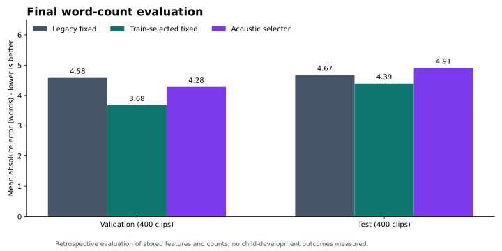

# Counting Words in Audio

**An exploratory study of speech measurement, acoustic features, and adaptive analyzer selection.**

Inspired by LENA's early-talk mission, this 2022 Erdős Institute team project asked whether properties of a recording could guide the choice of a silence-based word counter. It connects a practical measurement question with data preparation, statistical modeling, visual communication, and careful interpretation.

**Key finding:** acoustic features explained some variation in analyzer choice, but a retrospective evaluation of final word counts did not demonstrate a test-set advantage for the acoustic selector. This repository now separates the original experiments from a reproducible evaluation using comparable metrics.

## Start here

- [Research brief: question, methods, findings, and implications](docs/research-brief.md)
- [Runnable summary notebook](Summary.ipynb)
- [Evaluation methodology and corrections](docs/methodology.md)
- [Data dictionary and provenance](docs/data-dictionary.md)
- [Recomputed results](reports/metrics.csv) and [descriptive subgroup errors](reports/subgroup_metrics.csv)
- [Original 2022 notebooks](notebooks/legacy/) retained for research provenance



## Results in plain language

A silence-based counter treats speech separated by pauses as a proxy for words. We explored 64 parameter configurations and fit linear regression to predict an analyzer ID from onset count, mean onset strength, and the archived dominant-frequency feature.

The retrospective evaluation fits the selector on training data, rounds and bounds its predicted ID, looks up that analyzer's stored word count, and compares the resulting count with the transcript word count.

| Method | Validation MAE (words) | Test MAE (words) | Test MSE (words squared) |
| --- | ---: | ---: | ---: |
| Original fixed counter | 4.580 | 4.675 | 72.460 |
| Fixed counter selected on training relative error | 3.678 | 4.395 | 74.650 |
| Acoustic analyzer selector | 4.280 | 4.910 | 105.135 |

Lower error is better. The train-selected fixed counter has the lowest test MAE of these methods, while the original fixed counter has the lowest test MSE. The selector's training R² is 0.107 for **analyzer ID**, not word count.

The historical “76.9% lower MSE” comparison mixed analyzer IDs with word-count ratios. It does not support a word-count improvement or “twice the accuracy” claim. The [methodology](docs/methodology.md) explains the correction and other limitations.

## Reproduce the table evaluation

Python 3.12 was used for this retrospective review. The committed environment records the versions actually tested.

```bash
python -m venv .venv
# Activate your virtual environment, then:
python -m pip install -r requirements.txt
python scripts/evaluate.py --data-dir . --output-dir reports
python -m unittest discover -s tests
```

This workflow uses the three committed derived TSV tables, requires no audio download, and does not execute the historical notebooks. It writes final-count metrics, subgroup summaries, and a data audit with input hashes and fitted coefficients. The checked-in chart summarizes these results.

To regenerate the chart, run `python scripts/plot_results.py`.

To inspect interactively, install Jupyter in your environment and launch Jupyter from the repository root and open `Summary.ipynb`.

## Data and scope

The [Common Voice 2 subset on Kaggle](https://www.kaggle.com/datasets/danielgraham1997/commonvoice2) contains short English read-speech clips: 2,000 training, 400 validation, and 400 test. The supplied subset description identifies the source release as `en_1488h_2019-12-10`. See [the original subset instructions](commonvoice/README.txt).

This is independent, LENA-inspired research using Common Voice data. It did not use LENA system data, test child-development outcomes, count conversational turns, or validate a caregiver feedback program. Short read speech differs substantially from natural caregiver-child recordings.

## Contributors

- **Jonathan Doane**, Binghamton University: project lead; original notebooks and analysis.
- **Joanne Dong**, University of Michigan: collaborator; exploratory analysis retained with attribution.
- **Dananjaya Liyanage**: project mentor.

Original work: Erdős Institute, 2022. Retrospective evaluation and documentation: October 2026. Original research artifacts are preserved separately; the review does not reconstruct every historical execution step. Code licensing is documented in [LICENSE](LICENSE); dataset terms should be checked separately at the source.
